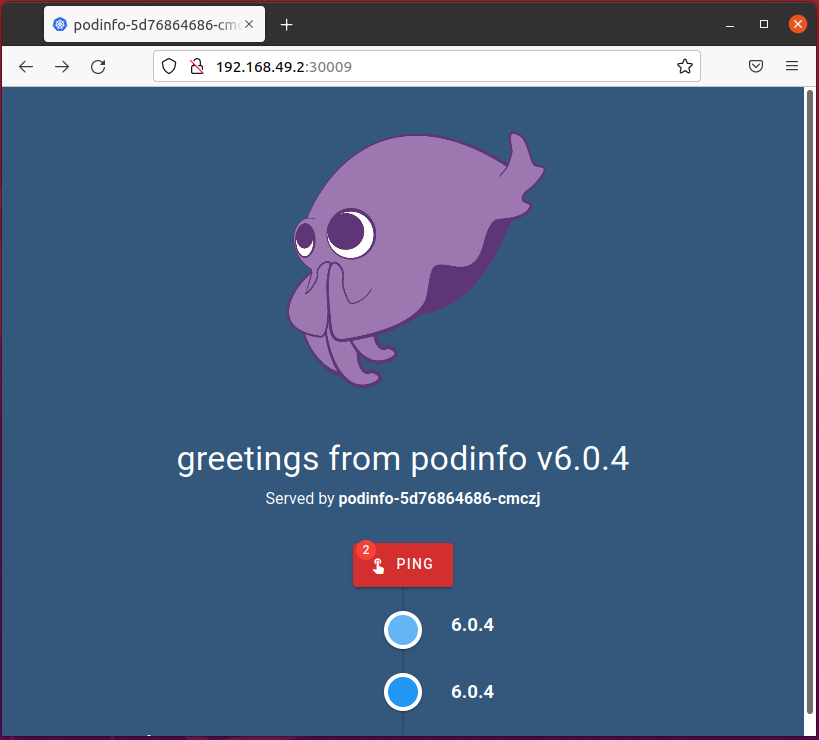

# Ubuntu Virtual Machine for NGINX Microservices March 2022 Labs

## Preface
Since I didn't have access to the lab environment in UDF, I decided to setup and run my own environment in VMware Workstation, so that I can run the [Microservices March Labs](https://github.com/f5devcentral/nginx_microservices_march_labs) at my own pace.
This guide should help anyone to setup their own Ubuntu VM to run the labs in your environment.
I won't cover the installation of the Ubuntu OS itself. One hint: on my Ubuntu host I disabled swap. 

## Software and Versions used
* Ubuntu 20.04 LTS
* Docker 20.10.13
* kubectl 1.23.4
* Helm 3.8.1
* Minikube v1.25.2

## Link to copy & paste commands
[copy_and_paste_commands.md](copy_and_paste_commands.md)

## Step 1: Install Docker

### Set up the repository
1. Update the apt package index and install packages to allow apt to use a repository over HTTPS:
```shell
daniel@ubuntu:~$ sudo apt update
daniel@ubuntu:~$ sudo apt-get install \
    ca-certificates \
    curl \
    gnupg \
    lsb-release
```
2. Add Docker’s official GPG key:
```shell
daniel@ubuntu:~$ curl -fsSL https://download.docker.com/linux/ubuntu/gpg | sudo gpg --dearmor -o /usr/share/keyrings/docker-archive-keyring.gpg
```
3. Use the following command to set up the stable repository. 
```shell
daniel@ubuntu:~$  echo \
  "deb [arch=$(dpkg --print-architecture) signed-by=/usr/share/keyrings/docker-archive-keyring.gpg] https://download.docker.com/linux/ubuntu \
  $(lsb_release -cs) stable" | sudo tee /etc/apt/sources.list.d/docker.list > /dev/null
```

### Install Docker Engine
1. Update the apt package index, and install the latest version of Docker Engine and containerd:
```shell
daniel@ubuntu:~$ sudo apt update
daniel@ubuntu:~$ sudo apt install docker-ce docker-ce-cli containerd.io
```
2. Add your user to the 'docker' group. 
```shell
daniel@ubuntu:~$ sudo usermod -aG docker $USER && newgrp docker
```

## Step 2: Install kubectl using native package management
1. Download the Google Cloud public signing key.
```shell
daniel@ubuntu:~$ sudo curl -fsSLo /usr/share/keyrings/kubernetes-archive-keyring.gpg https://packages.cloud.google.com/apt/doc/apt-key.gpg
```
2. Add the Kubernetes apt repository.
```shell
daniel@ubuntu:~$ echo "deb [signed-by=/usr/share/keyrings/kubernetes-archive-keyring.gpg] https://apt.kubernetes.io/ kubernetes-xenial main" | sudo tee /etc/apt/sources.list.d/kubernetes.list
```
3. Update apt package index with the new repository and install kubectl.
```shell
daniel@ubuntu:~$ sudo apt update
daniel@ubuntu:~$ sudo install kubectl
```

## Step 3: Install Helm from script
1. Download and run the installer script to install Helm
```shell
daniel@ubuntu:~$ curl -fsSL -o get_helm.sh https://raw.githubusercontent.com/helm/helm/main/scripts/get-helm-3
daniel@ubuntu:~$ chmod 700 get_helm.sh
daniel@ubuntu:~$ ./get_helm.sh
```

## Step 4: Install Minikube
1. Download Minikube as a static binary
```shell
daniel@ubuntu:~$ curl -Lo minikube https://storage.googleapis.com/minikube/releases/latest/minikube-linux-amd64 \
  && chmod +x minikube
daniel@ubuntu:~$ sudo cp minikube /usr/local/bin && rm minikube
```
2. Move the Minikube binary to your _/usr/local/bin_ location.
```shell
daniel@ubuntu:~$ sudo cp minikube /usr/local/bin && rm minikube
```

## Step 5: Start your local minikube cluster
```shell
minikube start --memory=4G
```
From here on you can follow the [lab guides](https://github.com/f5devcentral/nginx_microservices_march_labs).

## Problems observed
The lab guide mentions a couple of times that you can run commands like `minikube service podinfo` and this will display a chart like the one below and it would open the service in your browser.
```bash
$ minikube service podinfo
|-----------|---------|-------------|---------------------------|
| NAMESPACE |  NAME   | TARGET PORT |            URL            |
|-----------|---------|-------------|---------------------------|
| default   | podinfo |          80 | http://192.168.49.2:31190 |
|-----------|---------|-------------|---------------------------|
🏃  Starting tunnel for service podinfo.
|-----------|---------|-------------|------------------------|
| NAMESPACE |  NAME   | TARGET PORT |          URL           |
|-----------|---------|-------------|------------------------|
| default   | podinfo |             | http://127.0.0.1:51546 |
|-----------|---------|-------------|------------------------|
🎉  Opening service default/podinfo in default browser...
```
I could not get this working. However, what worked out for me was the following:
```bash
daniel@ubuntu:~$ minikube service --all
😿  service default/kubernetes has no node port
|-----------|------------|--------------|---------------------------|
| NAMESPACE |    NAME    | TARGET PORT  |            URL            |
|-----------|------------|--------------|---------------------------|
| default   | kubernetes | No node port |
| default   | podinfo    |           80 | http://192.168.49.2:30009 |
|-----------|------------|--------------|---------------------------|
```
And then I could open the app in the browser with the URL displayed here in this chart.

